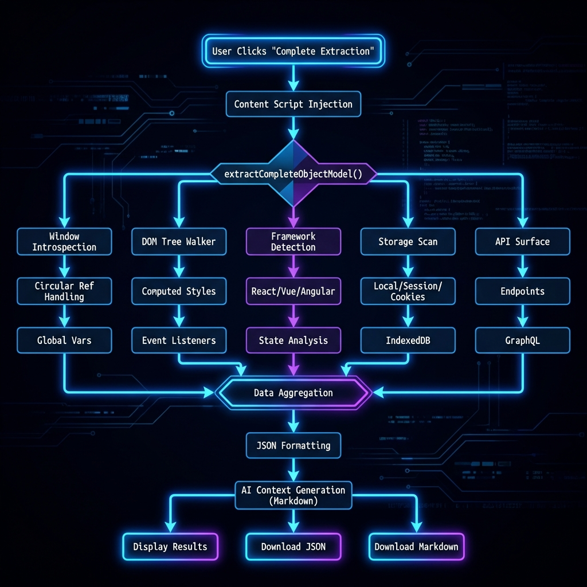

# ReMixr Inspector Enhancement - Complete Object Model Extraction

## Overview

The ReMixr Inspector tab has been significantly enhanced to **fully unravel and flatten the object model** of target websites. This transforms ReMixr into a powerful introspection tool that provides well-formed context models and artifacts for developers and their AI assistants.

## Core Objective

**Extract complete, AI-ready context from any website** to force-multiply development with assistive AI tools.

## New Capabilities

### 1. Complete Object Model Extraction

The Inspector now performs deep introspection of the target website's entire object model:

#### Window Object Introspection
- **Recursive traversal** of window properties with circular reference handling
- **Framework detection**: React, Vue, Angular, jQuery, Svelte, Next.js, Nuxt.js
- **Library detection**: Redux, Vuex, MobX, Axios, Lodash, D3, GSAP, and more
- **Custom globals**: Identifies all non-standard window properties

#### DOM Tree Serialization
- **Complete DOM structure** with metadata
- **Computed styles** for every element
- **Bounding boxes** and layout information
- **Data attributes** extraction
- **Custom elements** (Web Components) detection

#### Framework-Specific Extraction
- **React**: Component tree with props and state
- **Vue**: Component hierarchy with data and computed properties
- **Angular**: Version detection and module identification

#### State Management
- **Redux**: Full state tree extraction
- **Vuex**: Store state access
- **MobX**: Observable detection

#### API Surface Mapping
- **Endpoint detection**: Scans code for API URLs
- **GraphQL detection**: Identifies Apollo Client
- **Method signatures**: Documents available functions
- **Property enumeration**: Lists all accessible properties

#### Storage Extraction
- **localStorage**: All key-value pairs
- **sessionStorage**: Session data
- **Cookies**: All cookies with values
- **IndexedDB**: Database enumeration

#### Event Listeners
- **DOM event mapping**: Identifies all attached event listeners
- **Event types**: Click, input, submit, etc.
- **Element association**: Links events to specific elements

### 2. AI-Ready Context Generation

The Inspector generates two types of output optimized for AI consumption:

#### JSON Extraction
Complete, structured data including:
- Metadata (URL, domain, viewport, timestamp)
- Framework versions and component trees
- Global variables with type information
- Storage contents
- API endpoints
- Prototype chains
- Computed styles
- Data attributes

#### Markdown Context
Human-readable summary with:
- Technology stack overview
- Framework and version information
- State management patterns
- Global variable listing
- API endpoint documentation
- DOM structure statistics
- Computed style examples
- Usage instructions for AI assistants

## How to Use

### Step 1: Navigate to Target Website
Open the website you want to analyze in Chrome.

### Step 2: Open ReMixr
Click the ReMixr extension icon and navigate to the **Inspector** tab.

### Step 3: Extract Object Model
Click the **💎 Complete Extraction** button to perform deep introspection.

### Step 4: Review Results
The Inspector will display:
- Detected frameworks and versions
- State management systems
- Global variables count
- Storage statistics
- Custom elements

### Step 5: Export for AI
Choose your export format:

**Option A: Download Complete JSON**
- Click "📥 Download Complete Extraction (JSON)"
- Provides full data for programmatic analysis
- Use with AI tools that accept JSON input

**Option B: Download AI Context (Markdown)**
- Click "🤖 Download AI Context (Markdown)"
- Optimized for AI assistants like ChatGPT, Claude, Gemini
- Includes usage instructions and next steps

**Option C: Copy to Clipboard**
- Click "📋 Copy to Clipboard"
- Paste directly into AI chat interfaces

### Step 6: Transform with AI
Click the **🔮 Transform** button to automatically:
1. Extract the complete object model
2. Generate AI-ready Markdown context
3. Download the context file

## Use Cases

### 1. Extension Development
**Scenario**: Building a Chrome extension that integrates with a specific website.

**How ReMixr Helps**:
- Identifies available APIs and global objects
- Reveals framework versions for compatibility
- Extracts state management patterns
- Documents DOM structure for selectors

### 2. Web Scraping
**Scenario**: Need to extract data from a complex web application.

**How ReMixr Helps**:
- Maps the complete DOM tree
- Identifies data attributes
- Reveals API endpoints
- Documents dynamic content patterns

### 3. Reverse Engineering
**Scenario**: Understanding how a competitor's website works.

**How ReMixr Helps**:
- Detects technology stack
- Extracts component architecture
- Identifies third-party integrations
- Reveals state management approach

### 4. Security Analysis
**Scenario**: Auditing a website for security vulnerabilities.

**How ReMixr Helps**:
- Exposes global variables
- Lists all event listeners
- Reveals storage contents
- Documents API endpoints

### 5. Performance Optimization
**Scenario**: Analyzing a website's architecture for optimization opportunities.

**How ReMixr Helps**:
- Counts DOM elements
- Identifies framework overhead
- Maps prototype chains
- Documents computed styles

## AI Assistant Integration

### With ChatGPT/Claude/Gemini

1. Extract the Markdown context from ReMixr
2. Upload or paste into your AI chat
3. Ask questions like:
   - "What frameworks is this website using?"
   - "How can I integrate with this site's API?"
   - "What state management pattern should I use?"
   - "Generate a Chrome extension that interacts with this site"

### Example Prompts

**For Extension Development**:
```
I've extracted the object model from [website]. Based on this context, 
help me build a Chrome extension that [specific functionality].
```

**For Integration**:
```
Here's the complete extraction from [website]. I need to integrate 
with their [specific feature]. What's the best approach?
```

**For Analysis**:
```
Analyze this website extraction and identify:
1. The technology stack
2. Potential security concerns
3. Performance optimization opportunities
4. Integration points for my application
```

## Technical Details

### Extraction Depth
- **Window Object**: 3 levels deep (configurable)
- **DOM Tree**: 10 levels deep (configurable)
- **Component Trees**: 5 levels deep (configurable)
- **API Objects**: 2 levels deep (configurable)

### Performance Considerations
- Extraction typically completes in 1-3 seconds
- Large websites may take up to 5 seconds
- Results are cached for quick re-export
- Circular references are handled gracefully

### Privacy & Security
- All extraction happens locally in the browser
- No data is sent to external servers
- Sensitive data (passwords, tokens) should be reviewed before sharing
- Storage contents may contain personal information

## Extraction Process Flow



## Advanced Features

### Custom Element Detection
Automatically identifies Web Components (custom elements with hyphens in tag names).

### Prototype Chain Analysis
Documents available methods on core prototypes like HTMLElement, Element, Node.

### Framework Component Trees
For React and Vue applications, extracts the complete component hierarchy with props and state.

### Event Listener Mapping
Identifies all event listeners attached to DOM elements (requires Chrome DevTools Protocol).

## Limitations

1. **Cross-Origin Restrictions**: Cannot access iframes from different origins
2. **Obfuscated Code**: Minified/obfuscated code may have limited readability
3. **Dynamic Content**: Captures state at extraction time only
4. **Private Properties**: Some framework internals may be inaccessible
5. **Event Listeners**: Requires getEventListeners API (Chrome DevTools)

## Future Enhancements

- **Network Request Recording**: Capture actual API calls
- **WebSocket Monitoring**: Track real-time communications
- **Performance Metrics**: Include timing and resource data
- **Screenshot Integration**: Visual context alongside data
- **Diff Mode**: Compare extractions over time
- **Export Templates**: Customizable output formats

## Troubleshooting

### "Extraction failed" Error
- Ensure you're on a valid webpage (not chrome:// or file://)
- Check browser console for specific errors
- Try refreshing the page and extracting again

### Missing Framework Data
- Some frameworks hide their internals in production builds
- Try on development builds for more detailed extraction
- Check if the framework is loaded before extraction

### Empty Results
- Verify the page has finished loading
- Some SPAs may need time to initialize
- Try clicking the extraction button again

## Contributing

Found a framework or library that isn't detected? Want to add new extraction capabilities?

1. Fork the ReMixr repository
2. Add detection logic to `extraction-engine.js`
3. Update the display functions in `popup.js`
4. Submit a pull request

## License

Apache 2.0 - See LICENSE file for details

---

**ReMixr** - The Meta-Extension Builder
*Unravel. Flatten. Remix.*
