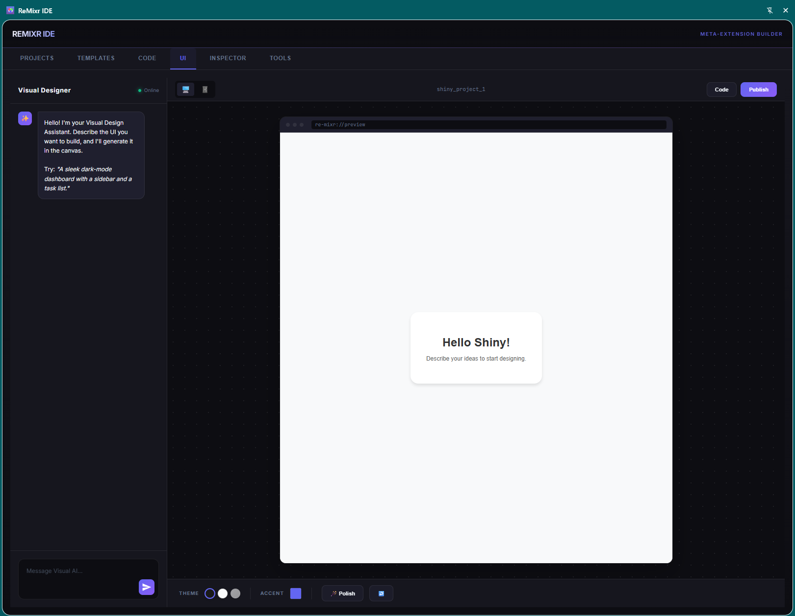
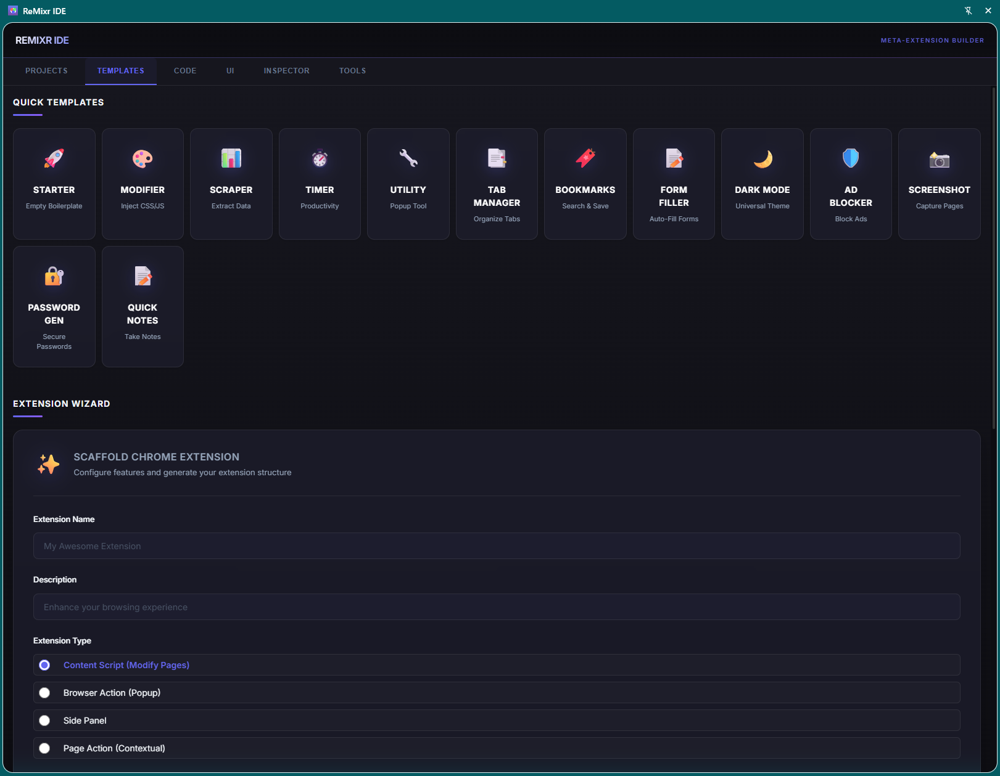
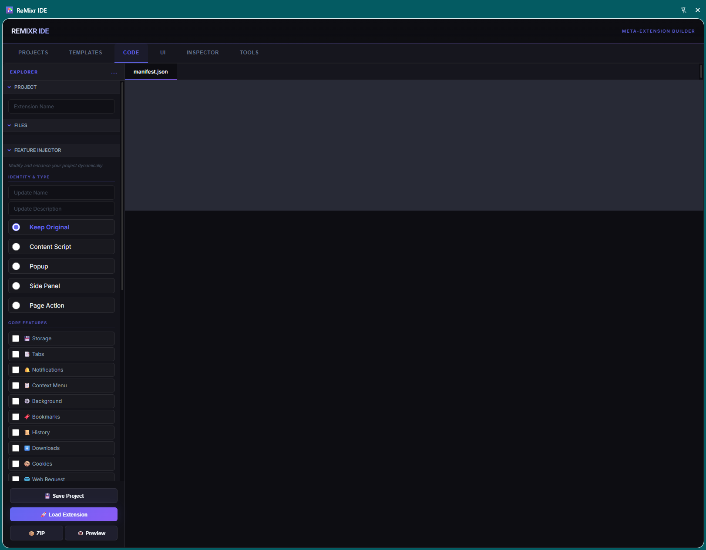
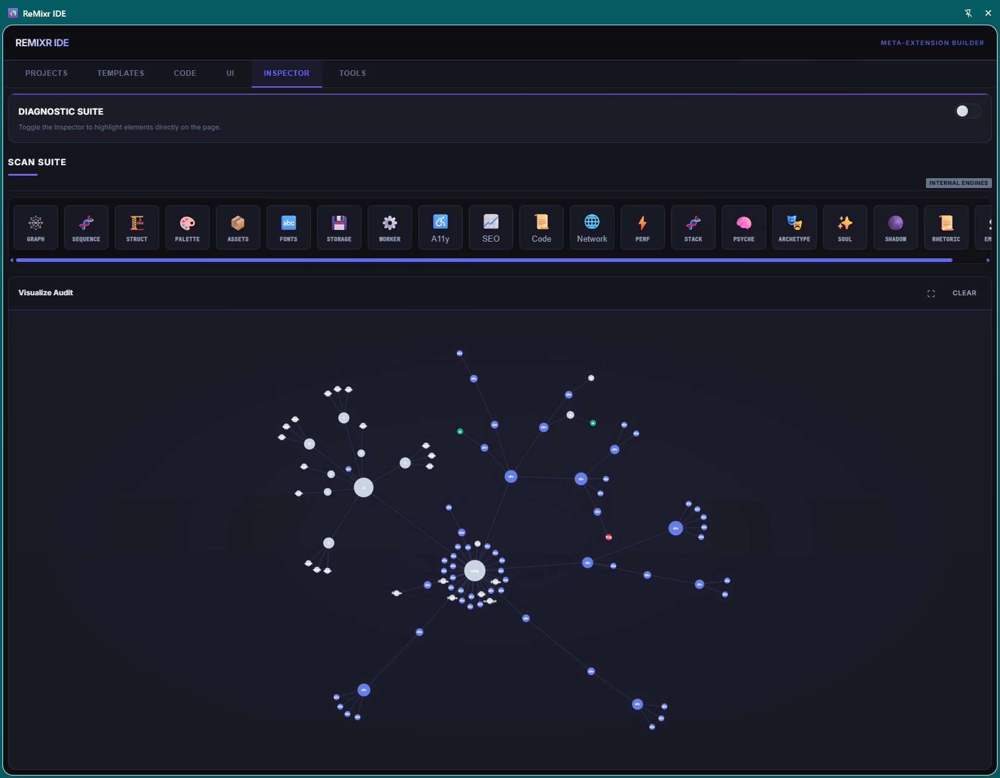
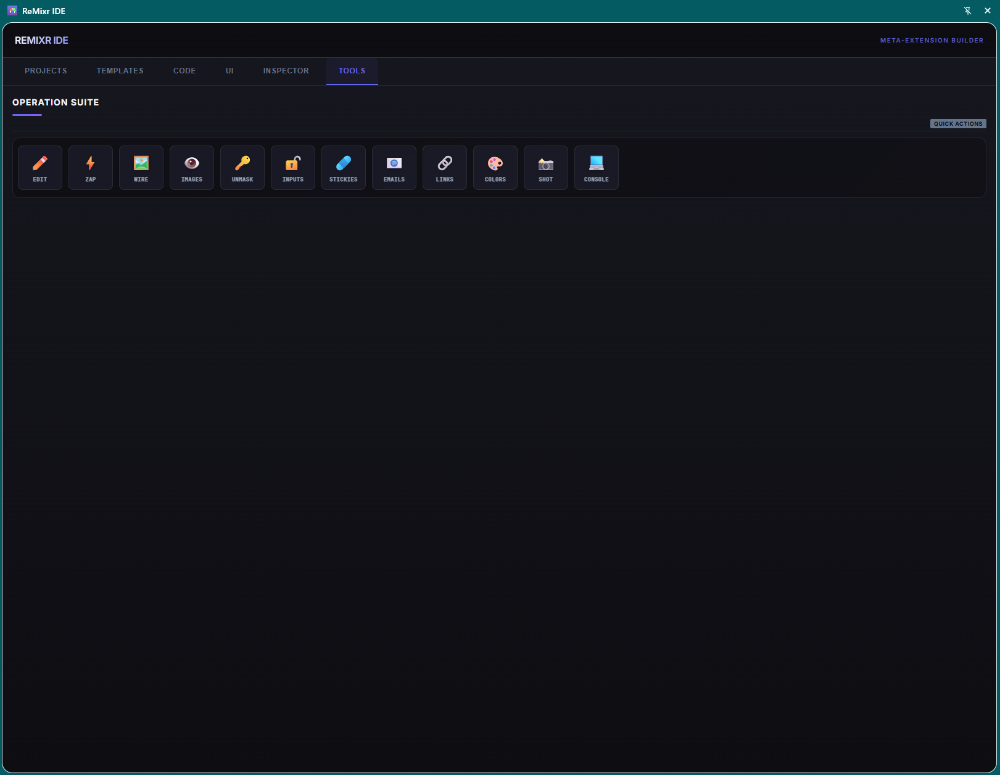

# 🎨 ReMixr

**The Ultimate Meta-Extension Builder & Web Analysis Suite**



ReMixr is a powerful browser extension that lets you **build other browser extensions** directly in your browser. It combines an AI-powered development environment (IDE) with a suite of sophisticated analysis and hacking ("MacGyver") tools, effectively giving you "Developer Superpowers" on any website.

## ✨ Features

### 🛠️ Extension Builder IDE
- **Extension Wizard**: Configure and generate fully bespoke Chrome extensions with a comprehensive wizard interface
  - Choose extension type (Content Script, Popup, Side Panel, Page Action)
  - Select from 10+ features (Background Worker, Storage, Tabs, Notifications, etc.)
  - Configure permissions and behaviors
  - Support for multiple UI frameworks (Vanilla JS, React, Vue, Svelte)



- **Feature Injector**: Add features to any project with one click
  - Inject 26 features from the wizard into any extension
  - **Core Features**: Storage, Tabs, Notifications, Context Menu, Background, Bookmarks, History, Downloads, Cookies, Web Request
  - **UI Components**: Side Panel, Theme Toggle, Keyboard Shortcuts, Badge Counter
  - **Behaviors**: Sync Storage, Auto-Open, Persist State, Match Site Style, Auto-Run, Analytics, Hot Reload, Error Tracking
  - Works with templates, wizard-generated, or AI-generated projects
  - Automatically updates manifest and adds working code
- **13 Quick Templates**: Start with professional, working templates:
  - 🚀 Starter, 🎨 Content Modifier, 📊 Data Extractor, ⏱️ Productivity Timer, 🔧 Popup Tool
  - 📑 Tab Manager, 🔖 Bookmark Organizer, 📝 Form Filler
  - 🌙 Universal Dark Mode, 🛡️ Ad Blocker, 📸 Screenshot Tool
  - 🔐 Password Generator, 📝 Quick Notes
- **AI-Powered Generation**: Describe your idea ("Make all backgrounds pink", "Extract emails"), and ReMixr builds the code
- **Professional Editor**: Integrated **CodeMirror** editor with Dracula theme, syntax highlighting, and live preview



- **One-Click Export**: Generates unique, ready-to-install `.zip` packages with custom icons
- **Project Management**: Save, clone, and manage multiple extension projects in a dedicated dashboard


### 🔍 Deep Analysis Suite
- **Interactive Inspector**: Point-and-click to identify unique CSS selectors
- **Visualizer**: View the DOM as a stunning **D3.js Force-Directed Graph**



- **Tech Stack Detector**: Identify frameworks (React, Vue, Next.js) used on the page
- **Performance**: Metrics on load times, asset counts, and storage usage
- **Psychological Analysis**: Detect dark patterns, persuasion techniques, and emotional design
- **SEO & Accessibility**: Comprehensive health checks

### � SITE_CONTEXT Extraction (Phase 2B)
**The Competitive Moat: Context-Augmented Development**

ReMixr's killer feature is **reverse-engineering websites** and extracting comprehensive context that supercharges AI code generation:

- **Unified Context Aggregation**: Combines all 14 analysis types into a single SITE_CONTEXT object
- **Quality Scoring**: Calculates extraction quality (0-100%) to ensure LLM-ready data
- **Smart Compression**: Optimizes context to <4000 tokens for efficient LLM processing
- **LLM Prompt Generation**: Automatically creates context-rich prompts for GPT-4/Claude
- **Chrome Storage Caching**: Reuses extracted context for 1-hour period
- **One-Click Export**: Copy LLM-ready prompts directly to ChatGPT/Claude

**What Gets Extracted:**
- 🏗️ **Structure**: DOM depth, node counts, semantic hierarchy
- 🎨 **Design**: Color palette, typography, spacing patterns
- 🧬 **Tech Stack**: Frameworks, libraries, build tools detected
- 📜 **Code Patterns**: Script architecture, event handlers, API calls
- 🔗 **Interactions**: Navigation patterns, forms, CTAs
- 🧠 **Psychology**: Dark patterns, persuasion techniques, UX strategies
- ⚡ **Performance**: Load times, asset counts, optimization opportunities
- ♿ **Quality**: Accessibility & SEO health metrics

**Why This Matters:**
Generic AI code generation is table stakes. ReMixr provides LLMs with **deep site-specific intelligence** that competitors cannot match—enabling generation of extensions that are perfectly adapted to the target website's structure, patterns, and behavior.

**Usage:**
1. Run desired scans (Structure, Palette, Stack, Code, Psyche, etc.)
2. Click **"Extract SITE_CONTEXT"** button (purple gradient button in Scan Suite)
3. Review quality score and extracted data
4. Click **"Copy LLM Prompt"** to generate context-augmented prompt
5. Paste into ChatGPT/Claude with your feature request
6. Get superior, site-specific extension code

### �🧰 MacGyver Tools (Operations)
- **Reality Distortion**: Edit text on any page, Zap elements instantly, View Wireframes
- **Lock Picking**: Unmask passwords, Force-enable disabled inputs, Remove sticky headers
- **Exfiltration**: One-click export of all Links, Colors, or specialized Data



## 🚀 Installation

### From Source (Developer Mode)

1.  **Build the Project**:
    ```bash
    npm install
    npm run build
    ```
    This creates a clean `build/` directory.

2.  **Load into Chrome**:
    *   Open `chrome://extensions/`
    *   Enable **Developer mode** (top right)
    *   Click **Load unpacked**
    *   Select the `ReMixr/build` folder

## 📖 Usage Guide

### ⌨️ Keyboard Shortcuts

**Boost your productivity with these shortcuts:**

| Shortcut | Action |
|----------|--------|
| `Ctrl+S` (Mac: `Cmd+S`) | Save Project |
| `Ctrl+E` (Mac: `Cmd+E`) | Export Extension |
| `Ctrl+P` (Mac: `Cmd+P`) | Preview |
| `Ctrl+N` (Mac: `Cmd+N`) | New Project |
| `Ctrl+/` (Mac: `Cmd+/`) | Show Keyboard Help |
| `Esc` | Close Preview/Modal |

*Tip: Press `Ctrl+/` anytime to see the shortcuts overlay!*

### Quick Start with Templates

1. **Browse Templates**: Go to the Templates tab
2. **Select a Template**: Click any template card (e.g., "Tab Manager", "Dark Mode")
3. **Customize**: Template loads in Builder - edit as needed
4. **Export**: Click "Download ZIP" and load into Chrome

### Create Bespoke Extension with Wizard

1. **Open Wizard**: Go to Templates tab, scroll to "Extension Wizard"
2. **Configure**:
   - Enter name and description
   - Select extension type
   - Check desired features
   - Configure permissions and behaviors
3. **Generate**: Click "Generate Extension"
4. **Customize**: Extension loads in Builder ready for editing
5. **Export**: Download and install

### Analysis Workflow

1. **Analysis Phase**: Before building, understand your target
   - Use the **Inspector** tab to scan the site
   - Use `Inspector` toggle to find CSS selectors
   - Check `Visualize` to see the site complexity

2. **Operational Phase**: Test your theories
   - Use **Tools → Edit Mode** to rewrite page copy live
   - Use **Tools → Zap** to clear clutter

3. **Build Phase**:
   - Go to **Builder**
   - Use AI prompt or wizard to generate code
   - **Preview** your changes live
   - **Export** your new extension

### 🛡️ Built-in Validation & Security

ReMixr includes intelligent validation to help you build secure, compliant extensions:

**Manifest Validation:**
- ✅ Manifest V3 compliance checking
- ✅ Required fields verification
- ✅ Permission security auditing
- ✅ Format validation (version, name length, etc.)
- ⚠️ Automatic warnings on save with detailed error messages

**Permission Auditing:**
- 🟢 Security score (0-100) based on permission scope
- 🔴 Warns about dangerous permissions (`<all_urls>`, `webRequest`, etc.)
- 🟡 Suggests privacy-friendly alternatives (e.g., `activeTab` instead of `tabs`)

**Code Validation:**
- ✅ JavaScript syntax checking
- ✅ CSP violation detection (`eval()` usage)
- ✅ Deprecated API warnings (Manifest V2 APIs)

*All validation runs automatically when you save—no configuration needed!*

## 📚 Documentation

- **[Quick Reference Guide](QUICK_REFERENCE.md)**: Complete guide to templates and wizard
- **[Feature Injector Guide](FEATURE_INJECTOR_GUIDE.md)**: How to inject features into any project
- **[Inspector Extraction Guide](INSPECTOR_EXTRACTION_GUIDE.md)**: Deep introspection and context extraction
- **[Inspector Quick Reference](INSPECTOR_QUICK_REFERENCE.md)**: Cheat sheet for extraction features
- **[Examples](EXAMPLES.md)**: Real-world extension examples
- **[Development Guide](DEVELOPMENT.md)**: For contributors
- **[Task Archives](archive/)**: History of project enhancements and remediations

## 🗺️ Roadmap

*   **Phase 1**: ✅ Extension Wizard & Expanded Templates (Complete)
*   **Phase 2**: ✅ Validation, Keyboard Shortcuts, Security Features (Complete)
*   **Phase 2B**: 🔄 **SITE_CONTEXT Extraction** (In Progress)
    - ✅ Context aggregation system
    - ✅ Quality scoring algorithm
    - ✅ LLM prompt generation
    - ✅ Chrome storage caching
    - 🔄 Multi-site validation testing
    - ⏸️ Full LLM API integration (blocked until context validation complete)
*   **Phase 3**: Cloud Gallery for sharing user-created Remixes
*   **Phase 4**: Automated Chrome Web Store publishing

## 🎯 Key Capabilities

### What You Can Build
- **Content Modifiers**: Change how websites look and behave
- **Data Extractors**: Scrape and export data from pages
- **Productivity Tools**: Tab managers, timers, note-takers
- **Privacy Tools**: Ad blockers, password generators
- **Utility Extensions**: Screenshot tools, form fillers
- **Custom Solutions**: Anything you can imagine!

### Supported Features
- ✅ Content Scripts
- ✅ Background Service Workers
- ✅ Browser Actions (Popups)
- ✅ Side Panels
- ✅ Context Menus
- ✅ Keyboard Shortcuts
- ✅ Storage (Local & Sync)
- ✅ Tab Management
- ✅ Notifications
- ✅ And much more!

## 📄 License

Licensed under the Apache License, Version 2.0. Copyright 2026 John Kost.
See [LICENSE](LICENSE) for details.

## 🙏 Acknowledgments

Built with:
- [CodeMirror](https://codemirror.net/) - Code editor
- [D3.js](https://d3js.org/) - Visualizations
- [JSZip](https://stuk.github.io/jszip/) - ZIP generation

---

**Ready to build?** Install ReMixr and start creating Chrome extensions in minutes!
